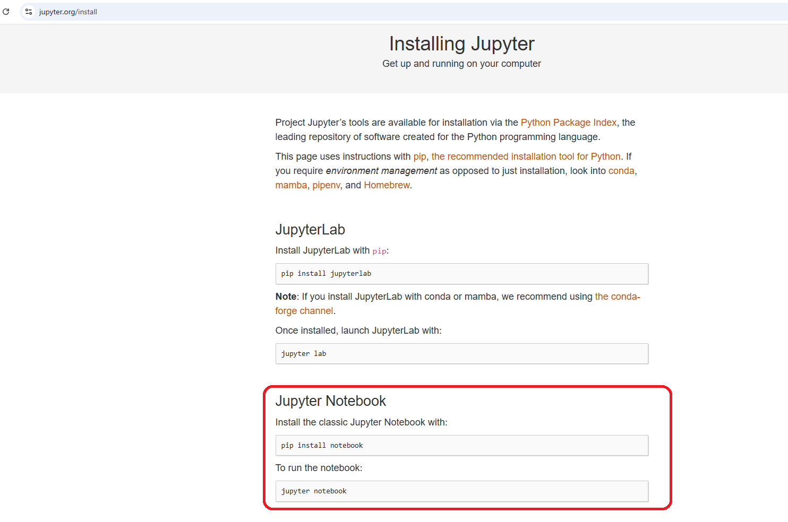
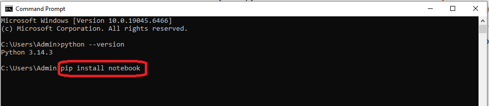
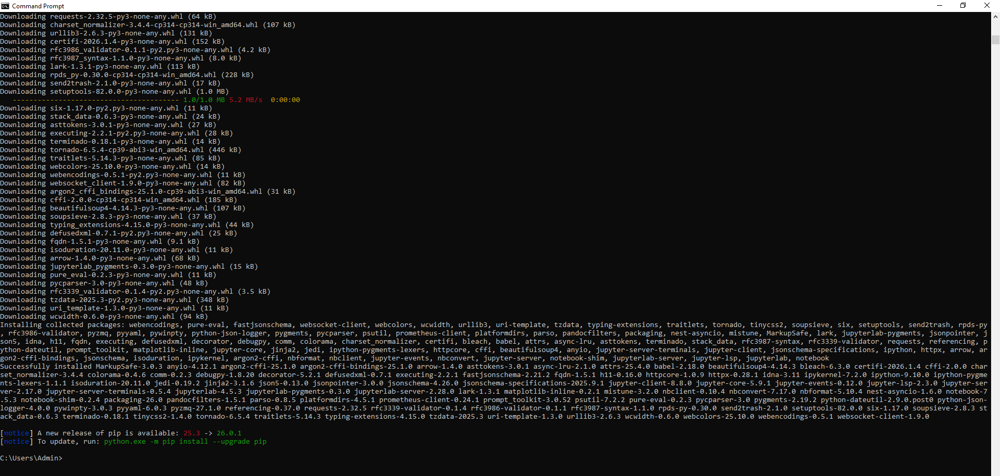
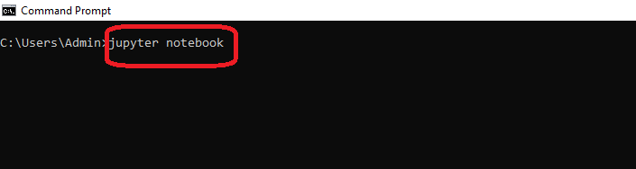
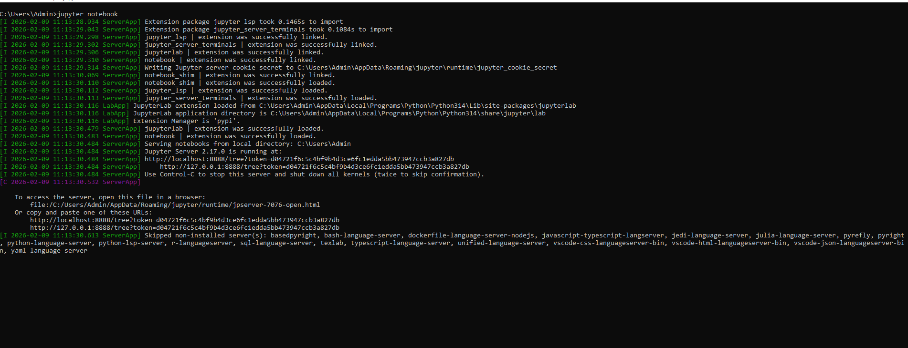
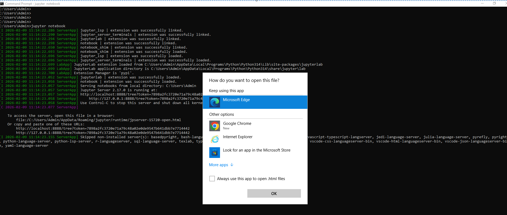
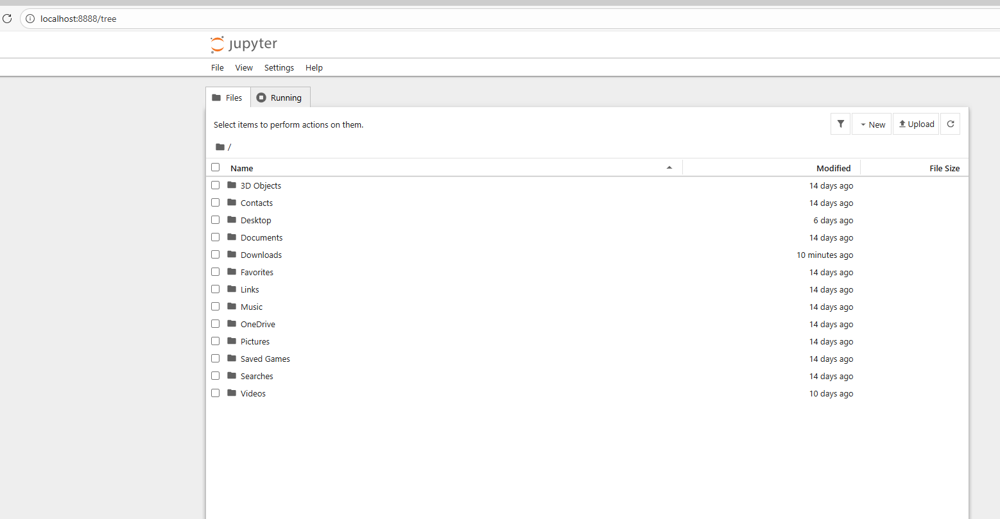
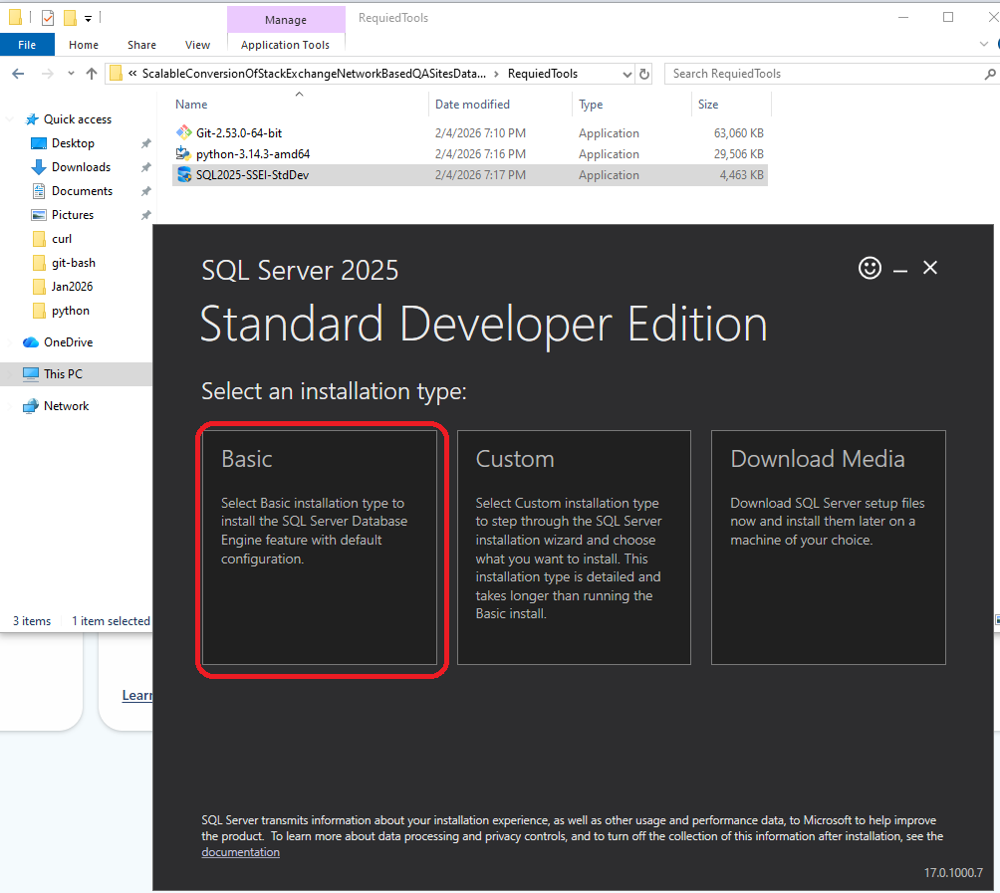

# Scalable Conversion of Stack Exchange Network-based Question Answering Sites’ Data Dump to SQL Server Database – A Case of Stack Overflow Data Dump
A replication package accompanying paper  entitled "Scalable Conversion of Stack Exchange Network-based Question Answering Sites’ Data Dump to SQL Server Database – A Case of Stack Overflow Data Dump"
## DOI to be added
This repository contains the replication package of the paper submitted to the Array Journal entitled _Scalable Conversion of Stack Exchange Network-based Ques-tion Answering Sites’ Data Dump to SQL Server Database – A Case of Stack Overflow Data Dump_

This method has been designed, developed, and reported by the following investigators:
1. Ms. Arjumand Fatima (Department of Computer Science, Quaid-i-Azam University)
2. Dr. Onaiza Maqbool (Department of Computer Science, Quaid-i-Azam University)
   
For any information, interested researchers can contact us by sending an email to any of the investigators listed above. The detailed step-by-step procedure is given below.

## How to cite the package
## Pre-requisites
### 1. Downloading the data dump
You first need to download the quarterly updated data dump of any of the Stack Exchange sites as explained [here](https://stackoverflow.com/help/data-dumps). We have utilized the latest data dump published in January 2026 for   _Stack Overflow_ which is the oldest among 182 Stack Exchange sites with the largest data dump to show the effectiveness of the proposed method.
### 2. Programming Languages, Tools, Operating System and Database Management System Used
You need to have the following up and running before following the step by step procedure.
1. Windows based Operating System (we have tested the procedure on Windows 10 Pro and Windows 11 Pro).
2. Python (we used Python version 3.13.9 which was installed through Anaconda Distribution; instead of downloading Python from its official site we preferred Anaconda Distribution as it contains Jupyter Notebooks and Pandas installed and has several other data science related libararies/pacakges installed).
3. Jupyter Notebook (to run the Python scripts provided in the paper; you may use command prompt or some other IDE if you have some experience of Python programming).
4. MS SQL Server Developer Edition (the database management system to store data; the Express Edition is not suitable due to 10GB database size limitation). [Download SQL Server 2025 Developer Edition](https://www.microsoft.com/en-us/sql-server/sql-server-downloads).
5. SQL Server Management Studio (SSMS) (a graphical user interface (GUI) based tool to play with data so that you don't have to use command prompt). [Download SSMS](https://learn.microsoft.com/en-us/ssms/install/install).
6. Git Bash (you need to install Git on Windows; Git Bash is an application for Microsoft Windows environments which provides an emulation layer for a Git command line experience). [Download Git for Windows /x64 Setup](https://git-scm.com/install/windows).
7. 7zip (if your Windows version does not provide native support to unzip 7zip files. Windows 11 (23H2 and later) versions have native support for 7zip files).   
### 3. Downloading and Installing the Required Tools
In this section we explain the downloading and installation steps for each of the required items listed above before moving to the actual procedural details. You can skip this section if you have already installed the requried tools. We assume that the readers have a Windows based machine for following these instructions.
#### 3.1 Anaconda Distribution of Python
Go to the [official Anaconda site](https://www.anaconda.com/download) where you will be required to sign up for downloading the distribution. After successful sign-up process, the system will offer you miniconda or anaconda distribution for download. Select anaconda distribution. Once downloaded, execute the installer by selecting Run as administrator from the context menu as shown below.
 
Click next to continue. 
 
Agree to the license agreement. 
 
Select installation type. 
 
Choose the install location (keep the default). 
 
Check the advanced installation options as shown below. 
 
The installation will begin. 
 
It will take a few minutes to complete the installation. 
 
Click next. 
 
Press finish. 
 
By now you have successfully installed Python and Jupyter Notebooks. 
#### Git Bash
Go to the [official website of git](https://git-scm.com/) and press the Install for Windows button as shown below. The download will begin. 
 
Once downloaded, run the installer. The setup wizard will appear as shown below. Click Next. 
 
Select destination location (keep the default value). 
 
Select components to be installed. Ensure Open Git Bash here is selected. Keep the rest as default. 
 
Choose the default editor for git. Several options are available in the drop down. Select the one you prefer. In our case, we didn't use any editor for git so the choice doesn't matter. 
 
Keep the default setting for the rest of the options presented to you before the installation begins. 
 
 
 
 
 
 
 
 
 
Press the install button. 
 
The installation will begin. 
 
Select launch git bash. 
 
A small command prompt like window will appear as shown below. 
 
#### 7zip

